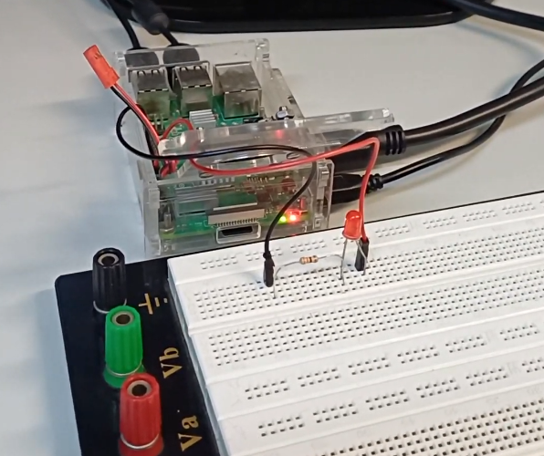

**Disciplina:** SEL0337 - Projetos em Sistemas Embarcados 
**Repositório para as atividades de SEL0337**
# Projeto 5: Configuração do SystemD e Controle de Versão com Git 
**Nomes:** Thiago Ferreira Pires, Francisco Ygor Grangeiro de Sousa  
**N° USP:** 14754762, 14680979

## Resumo
A Prática 5 teve como objetivo explorar o processo de inicialização (*boot*) do sistema operacional Linux embarcado na Raspberry Pi. Foi criada uma unidade de serviço personalizada (*systemd service unit*) para gerenciar a execução automática de uma aplicação em Python assim que o sistema é energizado. Além disso, a prática consolidou o uso do Git como sistema de versionamento e do GitHub como repositório remoto e ferramenta de documentação.

## Parte 1: Configuração do SystemD com Python

### Objetivo e Funcionamento
O objetivo desta etapa foi configurar o **SystemD**, o sistema de inicialização padrão do Raspberry Pi OS, para gerenciar um script em Python personalizado.

A aplicação desenvolvida controla um LED conectado à GPIO 18 da Raspberry Pi. O comportamento esperado é:

1.  Ao ligar a Raspberry Pi, o serviço é iniciado automaticamente, fazendo o LED piscar.
2.  Ao parar o serviço manualmente, um script de parada é executado para desligar o LED.

### Implementação dos Scripts

Para esta tarefa, ao invés de utilizar *shell script* (bash), utilizou-se a linguagem **Python** com a biblioteca `gpiozero` para controle do hardware, conforme solicitado na tarefa da prática.

#### 1. Script Principal (`blink_gpiozero.py`)
Este é o programa executado pelo serviço (`ExecStart`). Ele configura o LED no pino GPIO 18 e entra em um *loop* infinito, alternando o estado do LED a cada 1 segundo.

```python
from gpiozero import LED
from time import sleep

led = LED(18) #GPIO 18

try:
    while True:
        led.on()
        print("LED on")
        sleep(1)
        led.off()
        print("LED off")
        sleep(1)

except KeyboardInterrupt:
    pass
```

#### 2. Script de Parada (blink2.py)
Este script é chamado quando o serviço é interrompido (ExecStop), garantindo que o LED não permaneça aceso após o fim do processo.

```python
from gpiozero import LED
from time import sleep

led = LED(18)
led.off()
```

Então, Para que o SystemD gerencie os scripts acima, foi criado o arquivo de unidade blink7962.service, presente neste repositório. Este arquivo define as dependências, o usuário de execução e os caminhos absolutos para os scripts. 

Após criar e copiar o arquivo .service para /lib/systemd/system/, utilizamos o utilitário systemctl para controlar o serviço, habilitar no boot: sudo systemctl enable blink7962.service, iniciar manualmente: sudo systemctl start blink7962.service, verificar status: sudo systemctl status blink7962.service e parar serviço: sudo systemctl stop blink7962.service

## Montagem e Resultados
A montagem física consistiu na conexão de um LED à porta GPIO 18 da Raspberry Pi, com um resistor limitador de corrente em série.

Montagem Prática:



Ao reiniciar a Raspberry Pi, o LED começou a piscar automaticamente sem intervenção do usuário, comprovando que o serviço foi carregado corretamente durante o boot (estágio init system). O status do serviço pôde ser verificado via terminal, onde o comando systemctl status indicou "active (running)".

Foi gravado um vídeo demonstrando o funcionamento, segue o link: https://drive.google.com/file/d/1AXNkV673j1UFmF4vW7TMBt_E_tfxG7qA/view?usp=drive_link

# Parte 2: Controle de Versão (Git e GitHub)
Nesta etapa, utilizamos o Git para versionar os códigos desenvolvidos. O fluxo de trabalho incluiu, inicialização do repositório local, adição dos arquivos (git add), registros de alterações (git commit) e sincronização com o repositório remoto no GitHub (git push).

O histórico completo de commits e modificações realizadas durante o desenvolvimento pode ser visualizado no arquivo de log gerado: historico_log.txt (Disponível neste repositório).

# Conclusão
A prática permitiu a compreensão do funcionamento do SystemD e a importância dos Service Units para a automação em sistemas embarcados, eliminando a necessidade de execução manual de scripts. Além disso, reforçou o uso de boas práticas de documentação e versionamento de código, essenciais para o desenvolvimento de projetos colaborativos e profissionais.
